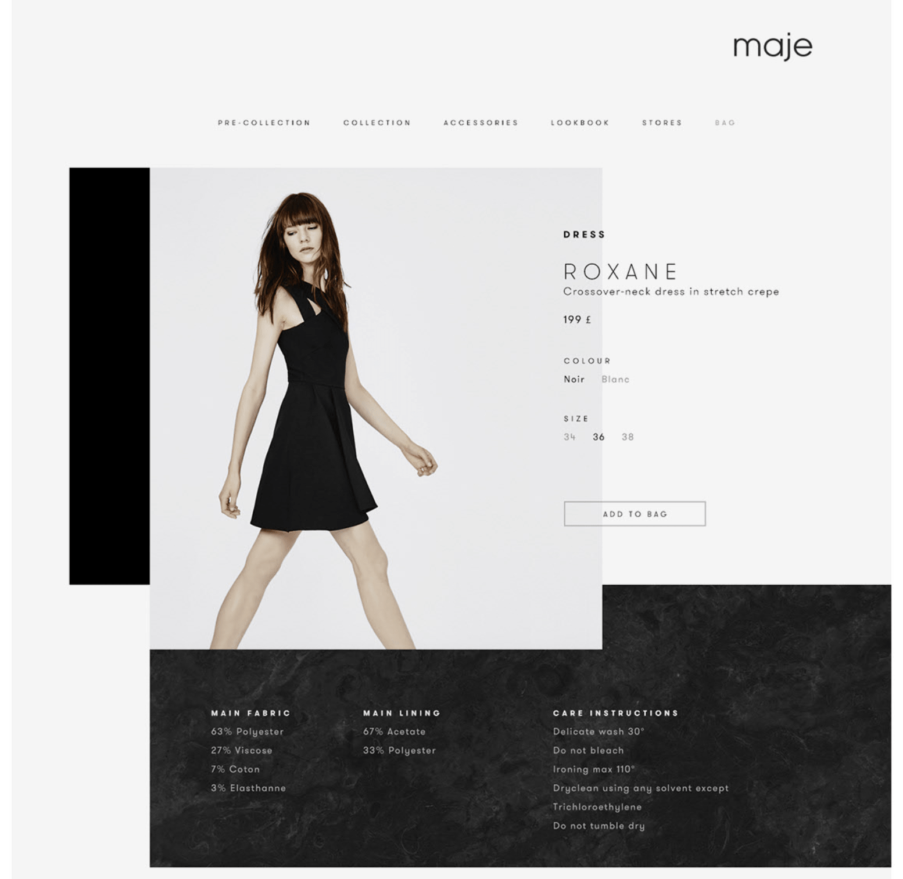

# sale-item-display-vue

## The Task

For this task, you are to convert this screenshot into a vue page that
matches the look of it. The vue page should take a gift id in the
parameter, and should retrieve the product details from an API call
using the provided gift id.
For the product details, here are the requirements:

- The header and footer are static (they don't need to be links).
- The API to retrieve the gift ids will be
  https://portal.giftagram.com/api/gift/details?ids=2529 (You can swap
  2529 for a different gift id)
- For the font, use any Google Font that is close to the font in the
  image and the footer background can be black (no image required).
- For the product details (including image, name, category, and
  price), you can use the following fields (image, name,
  default_category, price).
- For bonus points, if a gift (such as gift id 2529) has options,
  display the options on the page are they displayed in the screenshot.
  (ie the options are in grey but if a user selects an option it is
  displayed in black).
- You should only use vue in your code and no other framework
  (including jQuery).



## Project setup

```
npm install
```

### Compiles and hot-reloads for development

```
npm run serve
```

### Compiles and minifies for production

```
npm run build
```
